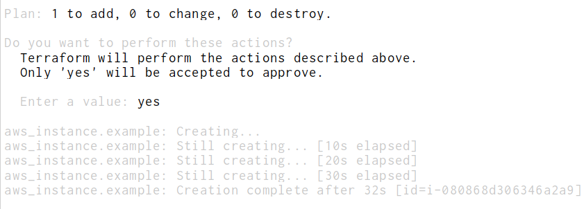
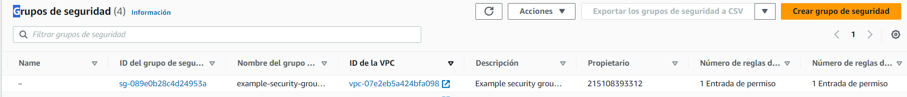

# Objetive
The objective of this "simple architecture" project is to create a virtual machine that will have a simple architecture where it:
- VPC -default
- subnet -default
- availability zone - eu-west-2 (London)
- resource name - EC2Ubuntu


# Requirements:
- AWS account
- user with appropriate permissions.
- Access key id and secret access Key.


# Configuration aws cli

- check what configuration you have in aws
```shell
aws configure list
```
- If you need to update your configuration
```shell
aws configure
```

- add aws access key (20 characteres)
- add aws secret access key  (30 characteres)
- add your defaul region name: eu-west-2
- default ouptut format [json[: empty
- enter

check again the configuration list

# Creating an empty  EC2 instance

```terraform
provider "aws" {
  region = "eu-west-2"
}

resource "aws_instance" "example" {
  ami           = "ami-0eb260c4d5475b901"
  instance_type = "t2.micro"

  tags = {
    Name = "EC2Ubuntu"
  }
}
```


# Run the project
- Open the console
- go to the folder where you have store the main.tf file
- run the next commands:
```shell
terraform init
```
```shell
terraform apply
```
```shell
terraform apply
```
(you ou have to accept terraform apply)

<br><br>
- go to the aws console on the browser and check EC2 instances

# Adding a Security Group
```terraform
provider "aws" {
  region = "eu-west-2"
}

resource "aws_instance" "example" {
  ami           = "ami-0eb260c4d5475b901"
  instance_type = "t2.micro"

  tags = {
    Name = "EC2Ubuntu"
  }
}

resource "aws_security_group" "instance" {
  name        = "example-security-group-terraform"
  description = "Example security group-terraform"

  # Entry and exit policy
  ingress {
    from_port   = 80
    to_port     = 80
    protocol    = "tcp"
    cidr_blocks = ["0.0.0.0/0"]
  }

  egress {
    from_port   = 0 # anywhere
    to_port     = 0
    protocol    = "-1"
    cidr_blocks = ["0.0.0.0/0"] #from which IP we can enter
  }


}
```
# Run the project
- Open the console
- go to the folder where you have store the main.tf file
- run the next commands:

```shell
terraform apply  -auto-approve #It is not going to ask to confirm the execution. 
```


# Install ngnix and access from internet
1. Definir VPC - security group
2. Use user_data script, to automate the installation and setup of Nginx on an EC2 instance when using Terraform to provision the infrastructure.

The user_data attribute in Terraform is used to provide instance-level customization for resources such as EC2 instances in AWS. It allows to run scripts or commands during the bootstrapping process of an instance.
```terraform
 vpc_security_group_ids = [aws_security_group.instance.id] # It does reference to the next security we are going to create

  user_data = <<-EOF
              #!bin/bash
              sudo amazon-linux-extras install nginx1.12 -y
              sudo service nginx start
              EOF
```

The user_data attribute is using a **heredoc** syntax (<<-EOF) to define a multi-line string. The string contains Bash commands that will be executed when the EC2 instance is launched.


**sudo amazon-linux-extras install nginx1.12 -y**: installs the Nginx web server on an Amazon Linux-based instance. The amazon-linux-extras command is used to install additional software packages on Amazon Linux instances.

**sudo service nginx start**: starts the Nginx service on the instance.