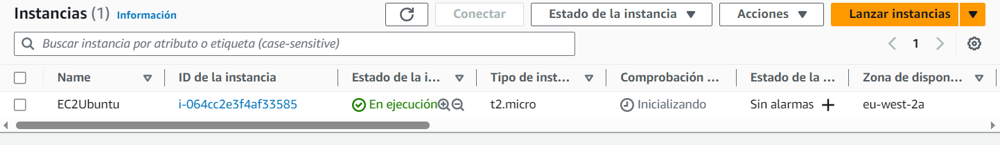

# Objetive
The objective of this "simple architecture" project is to create a virtual machine that will have a simple architecture where it:
- VPC -default
- subnet -default
- availability zone - eu-west-2 (London)
- resource name - EC2Ubuntu

# Requirements:
- AWS account
- user with appropriate permissions.
- Access key id and secret access Key.




# Configuration aws cli

- check what configuration you have in aws
```shell
aws configure list
```
- If you need to update your configuration
- ```shell
aws configure
```

- add aws access key (20 characteres)
- add aws secret access key  (30 characteres)
- add your defaul region name: eu-west-2
- default ouptut format [json[: empty
- enter

check again the configuration list